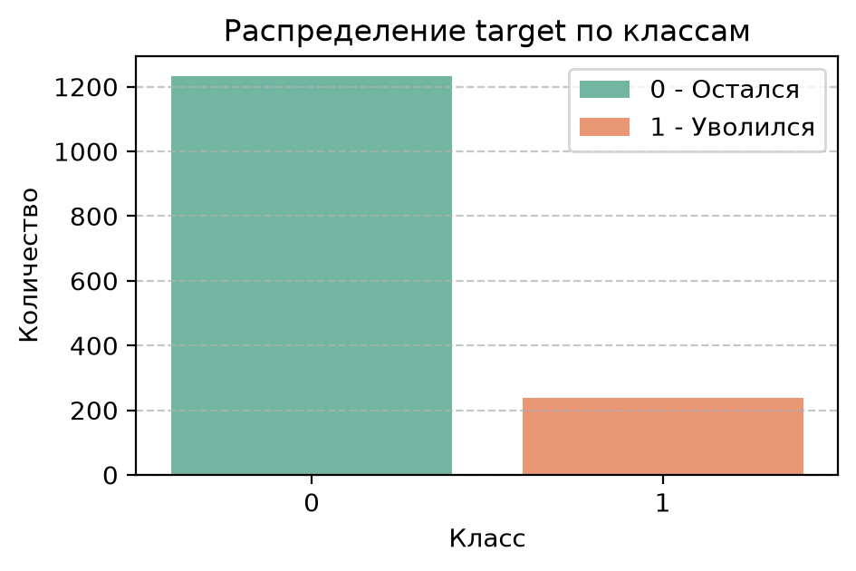
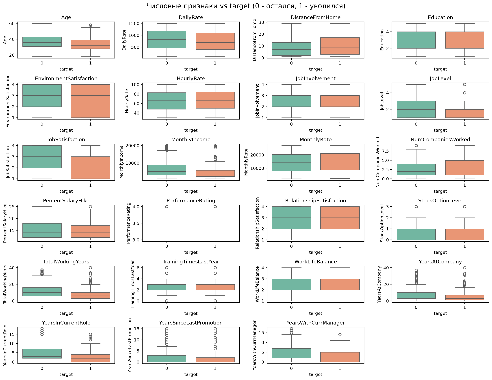
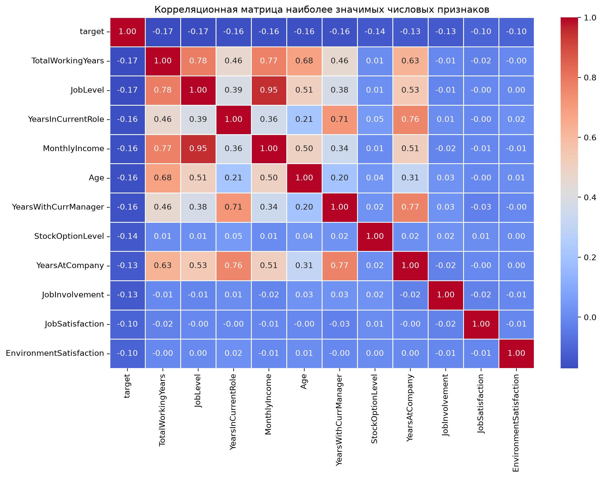
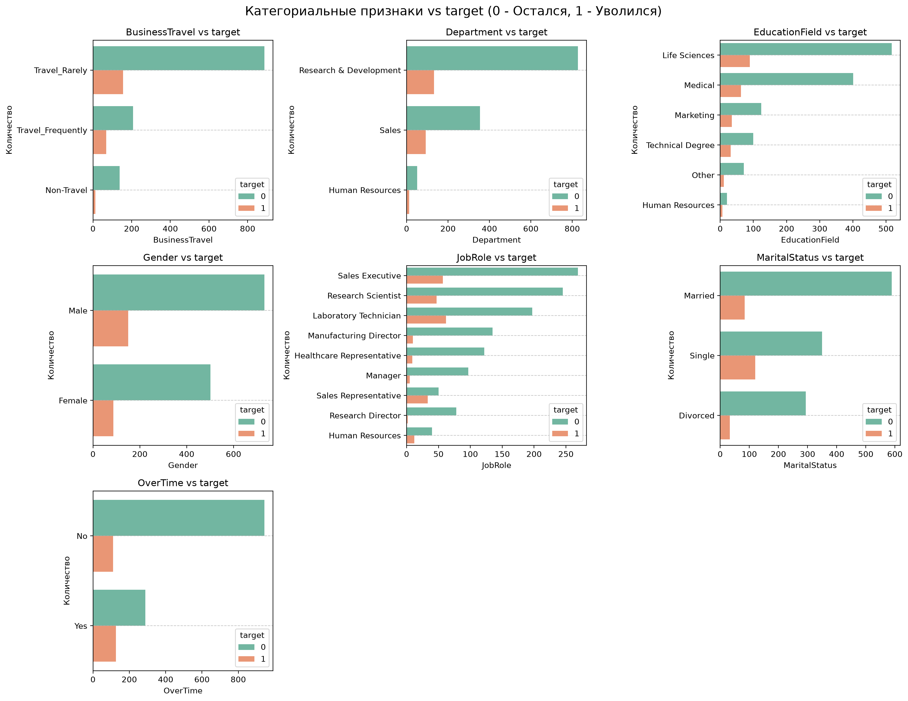
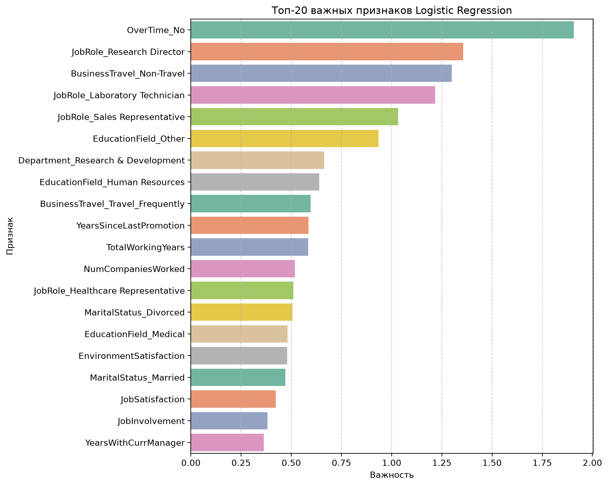

# HR Attrition Prediction — IBM HR Analytics

## 1. Цель
Задача — заранее находить сотрудников с высоким риском увольнения, чтобы HR успевал вмешаться (пересмотр нагрузки, грейда, командировок), а не оформлял уход по факту.
Метрика успеха для бизнеса — не accuracy, а умение ловить уходящих при приемлемой цене ложных тревог. Поэтому главные метрики — `PR-AUC` и `F1`, вспомогательная — `ROC-AUC`.

## 2. Данные
- Источник: Kaggle `IBM HR Analytics Employee Attrition` (`data/WA_Fn-UseC_-HR-Employee-Attrition.csv`).
- Размер сырых: `1470 строк x 35 колонок` (26 числовых `int64`, 9 категориальных `str`).
- После очистки: `1470 x 31` (`data/cleaned_data.csv`).
- Пропусков: `0`. Полных дубликатов: `0`.
- Удалены 4 столбца: `EmployeeNumber` (ID, 1470 уникальных), `Over18` (константа `Y`), `StandardHours` (константа `80`), `EmployeeCount` (константа `1`).
- Распределение target `Attrition -> target 0/1`: `No (остался) = 1233 (83.9%)`, `Yes (ушёл) = 237 (16.1%)` — сильный дисбаланс.



## 3. Что сделано по шагам
- `01_data_exploration_and_cleaning.ipynb` — описание 35 признаков, `info/describe/value_counts`, проверка пропусков и констант, удаление 4 мусорных столбцов, сохранение подготовленного датасета `cleaned_data.csv`.
- `02_visualization_and_analysis.ipynb` — EDA: баланс классов, `describe()`, ящики с усами числовых vs target, гистограммы с KDE, корреляционная матрица, срезы категориальных с долями увольнений. Графики сохранены в `img/`.
- `03_feature_engineering_and_prediction.ipynb` — удаление шумовых признаков по ставкам `Daily/Hourly/Monthly` (корреляция с target `-0.057/-0.007/+0.015`), 5 новых флагов  (`IsYoung, HighRisk, JobHopping, BadWorkLife, FarFromHome`), `stratify`-сплит `train 1176 (16.16%) / test 294 (15.99%)`, `ColumnTransformer` (`StandardScaler` + `OneHotEncoder`), 4 пайплайна, выбор лучшей по `PR-AUC`, тюнинг `GridSearchCV`.

## 4. Визуализация и выводы
Числовые признаки vs target — у ушедших сдвиг в сторону меньшего стажа, грейда и дохода:



Корреляции со знаком — все топ-10 отрицательные (`-0.17…-0.10`): `TotalWorkingYears, JobLevel, YearsInCurrentRole, MonthlyIncome, Age, YearsWithCurrManager`. Дольше работаешь, выше грейд и доход — ниже риск.



Категориальные группы риска: 
- `OverTime Yes 30.5% vs No 10.4%`, 
- `Travel_Frequently 24.9% vs Non-Travel 8.0%`, 
- `Sales 20.6% / HR 19.0% vs R&D 13.8%`, `Sales Representative 39.8%`, `Laboratory Technician 23.9%`, `Human Resources (сфера) 25.9%` на маленькой группе 27 строк.



## 5. Модели и результаты

### 5.1. Что означают метрики (расшифровка)
| Метрика | Что показывает | Почему важна здесь |
|---|---|---|
| `PR-AUC (0.61)` | Качество ранжирования риска по уходящим при дисбалансе 16% | Главная: HR работает со списком «сверху вниз по риску» |
| `F1 (0.47)` | Баланс точности и полноты при пороге 0.5 | Вторичная: одно число для сравнения моделей |
| `Precision 0.62` | Из 10 помеченных реально уйдут ~6 | Цена ложной тревоги (лишний разговор HR) |
| `Recall 0.38` | Поймаем ~4 из 10 уходящих | Цена пропуска (потеря сотрудника) |
| `ROC-AUC 0.82` | Отделение классов в целом | Вспомогательная, оптимистична при дисбалансе |
| `Accuracy 0.86` | Доля верных ответов | Не используем: 84% дает прогноз «все останутся» |

### 5.2. Сравнение моделей (один сплит, `random_state=42`)
| Модель | F1 | ROC-AUC | PR-AUC | Precision | Recall | Читать так |
|---|---|---|---|---|---|---|
| **Logistic Regression** | **0.4923** | **0.8150** | **0.5931** | 0.3855 | 0.6809 | Лучший баланс и ранжирование; ловит 2/3 уходящих |
| Random Forest | 0.4898 | 0.7878 | 0.4455 | 0.4706 | 0.5106 | Точнее, но хуже ранжирует риск |
| XGBoost | 0.4359 | 0.8100 | 0.5059 | 0.5484 | 0.3617 | Самый точный, но пропускает 2/3 уходящих |
| Decision Tree | 0.4333 | 0.6518 | 0.3517 | 0.3562 | 0.5532 | Слабее всех, переобучается |

Лучшая по `PR-AUC/F1` — `Logistic Regression`. Ее тюнили через `GridSearchCV (cv=5, scoring=average_precision)` по сетке `C / penalty / solver / class_weight`.

### 5.3. Финал после тюнинга (тест 294: 247 остались, 47 ушли)
| Класс | Precision | Recall | F1 | Support | Расшифровка |
|---|---|---|---|---|---|
| Остался (0) | 0.89 | 0.96 | 0.92 | 247 | Почти всех оставшихся находим верно |
| Ушёл (1) | 0.62 | 0.38 | 0.47 | 47 | Из 10 помеченных уйдут ~6; поймаем ~4 из 10 |
| Accuracy | — | — | 0.86 | 294 | Для справки, не целевая |
| ROC-AUC | — | — | 0.8176 | — | Хорошее разделение классов |
| PR-AUC | — | — | 0.6098 | — | Главный итог: риск ранжируется уверенно |

Матрица ошибок:
|  | Прогноз «останется» | Прогноз «уйдёт» |
|---|---|---|
| **Факт «остался» (247)** | TN ≈ 236 | FP ≈ 11 (лишние беседы HR) |
| **Факт «ушёл» (47)** | FN ≈ 29 (пропуски) | TP ≈ 18 (пойманные) |

Читать бизнесу: модель консервативна — шумит мало (всего 11 ложных тревог), но и ловит меньше половины. Если HR готов к большему числу бесед — двигаем порог вниз и растим recall.

### 5.4. Что влияет на уход (важности `|coef_|` LogReg)

Расшифровка актуального топ-15:
| # | Признак | \|coef\| | Читать так |
|---|---|---|---|
| 1 | `OverTime_No` | 1.9079 | Главный сигнал: отсутствие переработок = остается. Зеркало риска `OverTime Yes 30.5%` из EDA |
| 2 | `JobRole_Research Director` | 1.3566 | Топ-менеджмент — сильный маркер стабильности |
| 3 | `BusinessTravel_Non-Travel` | 1.2993 | Без командировок — остается. Зеркало `Travel_Frequently 24.9%` |
| 4 | `JobRole_Laboratory Technician` | 1.2161 | Группа риска из EDA (уход 23.9%) |
| 5 | `JobRole_Sales Representative` | 1.0322 | Главная группа риска из EDA (уход 39.8%) |
| 6 | `EducationField_Other` | 0.9340 | Редкая сфера образования — проверять отдельно |
| 7 | `Department_Research & Development` | 0.6646 | R&D удерживает лучше (уход 13.8% vs Sales 20.6%) |
| 8 | `EducationField_Human Resources` | 0.6387 | Маленькая группа (27 строк), уход 25.9% — шум возможен |
| 9 | `BusinessTravel_Travel_Frequently` | 0.5963 | Прямой флаг риска частых поездок |
| 10 | `YearsSinceLastPromotion` | 0.5859 | Застой без повышения растит риск |
| 11 | `TotalWorkingYears` | 0.5842 | Короткий общий стаж = выше риск (корр. −0.17) |
| 12 | `NumCompaniesWorked` | 0.5185 | Частая смена компаний = выше риск |
| 13 | `JobRole_Healthcare Representative` | 0.5105 | Еще одна роль-маркер |
| 14 | `MaritalStatus_Divorced` | 0.5058 | Семейный статус как слабый соцсигнал |
| 15 | `EducationField_Medical` | 0.4818 | Медики — базовая большая группа (464), риск ниже (13.6%) |
Картина один в один совпадает с EDA из раздела 4 — модель выучила то же, что мы увидели глазами: переработки, роль, командировки, застой, стаж.

### 5.5. Демо 
В конце `03` добавлена ячейка-демо: берутся 2 строки из теста с максимальным и минимальным `predict_proba`, печатается `риск XX.X%` и таблица по полям `Age / OverTime / JobRole / BusinessTravel / MonthlyIncome / JobSatisfaction / YearsAtCompany`. 

## 6. Структура и запуск
```
01_data_exploration_and_cleaning.ipynb
02_visualization_and_analysis.ipynb
03_feature_engineering_and_prediction.ipynb
data/*.csv, img/*.png
requirements.txt
```
Запуск:
```
python -m venv env
env\Scripts\activate
pip install -r requirements.txt
jupyter lab
# затем Kernel -> Restart & Run All по порядку 01 -> 02 -> 03
```

## 7. Ограничения
- Всего 1470 строк, оценка точечная на одном сплите; маленькие срезы шумят.
- Порог 0.5 не калиброван под бюджет HR — двигать по precision/recall.
